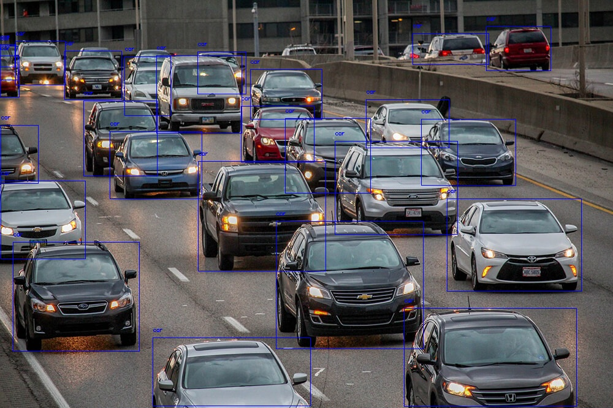
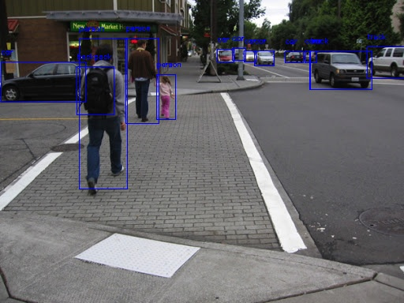
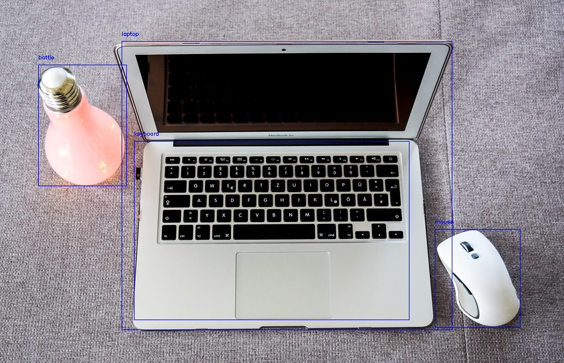

# RetinaNet
## Description
This project uses the pretrained RetinaNet model to find the bounding boxes and labels of elements in an image given a threshold and show results using cv2.

## Results
Using a 0.5 threshold :

